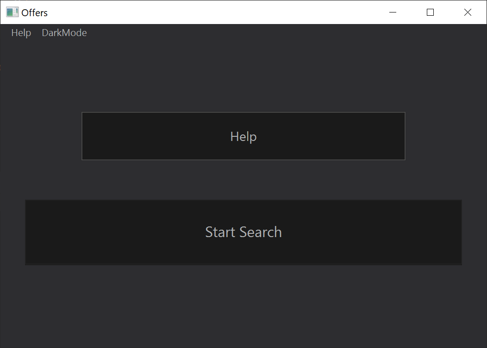

# Otodom Json Scrapper

A Python program that retrieves, processes, and stores real estate listings from Otodom in a MySQL database, and hosts a server for JavaFX client interaction. The JavaFX interface communicates with the Python server to display listings with user-defined filters via URL parsing. This project was created for educational purposes only. Do not use it against Otodom policy!

## Features

- **Data Retrieval:** Fetches real estate listings from Otodom.
- **Data Processing:** Processes data in json format to store only vital listing information.
- **Data Storage:** Uses MySQL database for data storage.
- **Server Hosting:** Hosts a server for interaction with a JavaFX client in order to avoid unsecure direct client-database communication.
- **Client Interface:** A JavaFX interface that communicates with the Python server to display filtered listings.

## Usage
After successfully searching the available offers, you can apply filters based on your preferences. These filters include the area of the flat, the number of rooms, and the rental price. In addition to filtering, you also have the option to sort the offers in either ascending or descending order. To do so, simply click on the header of the column you wish to sort by.

## Built with

**IDE:** Intellij IDEA Comunity Edition, Pycharm Community Edition
**Runtime:** jdk-17.0.1, python 3.9
**Database controll:** XAMPP
**Additional drivers:** mysql-connector-j-8.0.33  
**Additional libraries:** javafx, http.server, urllib.parse, json

## Preview

## Created by

- **[Dominik Bongowski](https://github.com/dbongowski)**
- **[Tomasz Downar-Zapolski](https://github.com/)**

## License

This project is licensed under the MIT License - see the [LICENSE](LICENSE) file for details.

## Acknowledgments

- This project was created for educational purposes.
- There is no data from [Otodom](https://www.otodom.pl) included in this repository.
